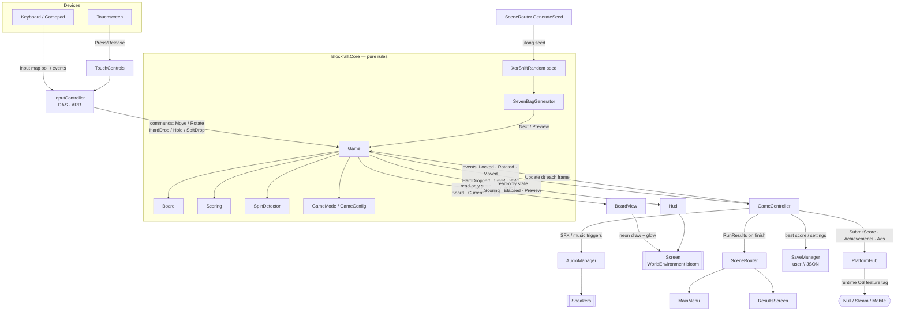

# Blockfall — Architecture

Blockfall is a neon falling-block puzzle built as two cleanly separated halves:

- **`Blockfall.Core`** — a pure, engine-agnostic C# rules library. It knows the
  full ruleset (SRS, 7-bag, hold, ghost, lock delay, T-spin, combo, back-to-back,
  perfect clear, scoring, mode goals) and **nothing** about Godot, rendering,
  input devices, audio, stores, or files.
- **`Blockfall` (the Godot project)** — the presentation and platform layer. It
  renders the neon board, reads devices, plays audio, drives UI/scene flow, and
  talks to the stores (Steam / AdMob / IAP). It *drives* the core and *reacts* to
  it, but never re-implements a rule.

The two never blur: the core exposes commands + read-only state + events; the
Godot layer subscribes and paints. Everything below elaborates that contract.

---

## 1. Layering — and why the split

```
┌─────────────────────────────────────────────────────────────┐
│  Godot project  (game/…)   — presentation + platform         │
│                                                              │
│  Bootstrap → SceneRouter → { MainMenu, GameController,       │
│                              ResultsScreen }                 │
│  GameController owns: BoardView, Hud, InputController,       │
│                       TouchControls                          │
│  Cross-cutting services: AudioManager, SaveManager,         │
│                          PlatformHub (Null/Steam/Mobile)     │
└───────────────▲───────────────────────┬─────────────────────┘
                │ events (out)           │ commands + reads (in)
                │                        ▼
┌─────────────────────────────────────────────────────────────┐
│  Blockfall.Core  (core/…)  — pure rules engine, no Godot     │
│                                                              │
│  Game ── Board ── Piece ── Tetromino(SRS) ── SpinDetector    │
│    │        Scoring        Randomizer(7-bag)                 │
│    └── GameMode / GameConfig / GameEvents                    │
└─────────────────────────────────────────────────────────────┘
```

**Why the hard boundary is worth it:**

1. **Determinism & testability.** The core is deterministic given a seed plus the
   same command/`dt` sequence, with no engine types on the hot path. That is why
   it carries 51 xUnit tests that run in milliseconds with no Godot runtime. Rule
   bugs are caught in `core.tests`, not by playing the game.
2. **Portability.** The same rules power Android, iOS, and Steam (Win/macOS/Linux)
   without change. A future headless server, replay verifier, or bot can link the
   same library.
3. **Trademark hygiene.** "Blockfall" is an original brand. The core deliberately
   uses its own naming (`PieceType`, `Tetromino` as a class name only) and never
   ships the trademarked term or the official color mapping.
4. **Separation of churn.** Visual/juice/store work (the volatile part) can move
   fast without risking the rules (the stable part).

The core targets plain .NET 8; the game references it as a project reference and
adds Godot 4.3 + the C# bindings on top.

---

## 2. Core class map (`Blockfall.Core`)

| Type | File | Responsibility |
|------|------|----------------|
| `Game` | `Game.cs` | The engine heart. Owns board, active piece, gravity, lock delay, hold, scoring, mode goals. Exposes command methods (`MoveLeft`, `RotateCw`, `HardDrop`, `HoldPiece`, `SetSoftDrop`…), an `Update(dt)` tick, read-only state, and events. |
| `Board` | `Board.cs` | 10-wide grid with a hidden spawn buffer above the visible field. Collision (`CanPlace`), `Lock`, `ClearFullRows`, `HardDropTarget`, `IsLanded`, `IsEmpty` (perfect-clear). Row-major `PieceType[]`, no per-call allocations on collision (`stackalloc`). |
| `Piece` | `Piece.cs` | Immutable-by-convention live piece: `Type`, `State`, bounding-box `Origin`. `Moved`/rotation helpers return **new** pieces so the caller can validate before committing. `CellsInto(Span)` avoids per-frame allocs. |
| `Tetromino` | `Tetromino.cs` | Static **SRS** shape + wall-kick data. Occupied cells per piece per rotation state, spawn origins, and the JLSTZ / I / O / 180 kick tables. Kicks are stored in canonical SRS (x-right, y-up) so they diff against public references; converted to board space at apply time. |
| `Scoring` | `Scoring.cs` | Guideline scoring state machine: line values scaled by level, T-spin (mini/full) values, back-to-back ×1.5, combo bonus, soft/hard-drop points, perfect-clear bonuses, and level/line progression (10 lines per level). Returns a `ClearResult` per lock. |
| `SpinDetector` | `SpinDetector.cs` | Classifies T-spins via the 3-corner rule. Requires piece=T, last action was a rotation, ≥3 box corners filled; promotes to **full** when both front corners are filled or the far (5th) kick was used, else **mini**. |
| `Randomizer` | `Randomizer.cs` | `IRandomSource` + `XorShiftRandom` (stable across .NET versions, unlike `System.Random`, so daily seeds match between mobile and Steam) and `IPieceGenerator` + `SevenBagGenerator` (Fisher-Yates 7-bag with `Preview`). |
| `GameMode` | `GameMode.cs` | Declarative rule set per mode: goal (line goal / time limit / level cap), start level, top-out behavior, and a `GameConfig`. Factory presets for Marathon (cap 15), Sprint 40, Ultra 2:00, Zen. `IsGoalReached(...)` evaluates completion. |
| `GameConfig` | `GameConfig.cs` | All timing/tuning knobs: gravity curve (`GravityForLevel`), soft-drop factor, lock delay + max resets, DAS/ARR, preview count, hold/ghost toggles. Designers rebalance here without touching logic. |
| `GameEvents` / primitives | `GameEvents.cs`, `Primitives.cs` | Event payloads (`LockEvent`, `RotationEvent`, `MoveKind`), `ClearResult`/`SpinType`, `RunStats`, and shared primitives (`PieceType`, `RotationState`, `Vec2`, `Kick`). |

### Notable core mechanics

- **Coordinate convention.** `Vec2` is (row, col) with row growing **downward**.
  SRS kicks use (x-right, y-up); `Game.TryRotate` converts each kick with
  `row -= y, col += x`.
- **Lock delay with move reset.** `Game.Update` accumulates gravity, then while
  the piece is landed runs a `_lockTimer` up to `Config.LockDelay`. Any successful
  move/rotate while resting resets the timer but increments `_lockResets`, capped
  at `Config.MaxLockResets` (15) so a piece cannot be stalled forever. Genuine
  downward progress (`OnDownwardProgress`) fully resets both.
- **T-spin timing.** The spin type is classified in `LockPiece` **before** the
  board is mutated, using `_lastActionWasRotation` + `_lastKickIndex` captured by
  the last successful rotation.
- **Top-out.** Two guideline conditions: **block-out** (spawn overlaps stack) in
  `SpawnPiece` and **lock-out** (piece locks entirely above the visible field) in
  `LockPiece`. Modes with `CanTopOut = false` never end this way.

---

## 3. The event-driven boundary between core and view

The core is the single source of truth; the view is a projection of it. The two
communicate in exactly two directions:

**Inbound (view → core): commands.** `InputController`/`TouchControls` translate
devices into `Game` command calls (`MoveLeft`, `RotateCw`, `HardDrop`,
`HoldPiece`, `SetSoftDrop`), and `GameController._Process` calls `Game.Update(dt)`
once per frame. Commands are pure state mutations that return a `bool` success
flag; they never touch Godot.

**Outbound (core → view): events + read-only state.** `Game` raises C# events the
presentation layer subscribes to (in `GameController.WireEngineEvents`):

| Event | Payload | Consumed for |
|-------|---------|--------------|
| `PieceSpawned` | `Piece` | (available for spawn juice) |
| `PieceMoved` | `MoveKind` | move SFX |
| `PieceRotated` | `RotationEvent` (success, kick index, new state) | rotate SFX |
| `PieceLocked` | `LockEvent` (piece, cleared rows, `ClearResult`) | row-flash, line-clear/perfect SFX |
| `HardDropped` | distance | hard-drop SFX |
| `HoldChanged` | `PieceType` | hold SFX |
| `LevelChanged` | new level | level-up SFX |
| `GameOver` / `Completed` | — | end the run (`GameController.Finish`) |

For per-frame rendering the view **pulls** read-only state instead of relying on
events: `BoardView` reads `Game.Board`, `Game.Current`, and `Game.GhostPiece()`
each `_Draw`; `Hud` reads `Scoring`, `Elapsed`, `Hold`, and `Preview()` each
`_Process`. The view **never mutates** the core. This pull-for-state /
push-for-moments split keeps rendering trivially correct and lets audio/particles
fire exactly once per event.

---

## 4. Presentation layer (Godot project)

```
Bootstrap (Node2D, Main.tscn root, Bootstrap.Instance singleton)
├── WorldEnvironment          neon bloom / additive glow
├── SaveManager               user:// persistence (best scores + settings)
├── PlatformHub               runtime store backend selection
├── AudioManager              music + pooled SFX
└── SceneRouter               owns the current screen, swaps typed data
        ├── MainMenu          title + 4 mode buttons + best scores
        ├── GameController     ← one play session
        │     ├── BoardView    draws panel/grid/stack/ghost/current/flash
        │     ├── Hud          score/level/lines/clock/goal, hold, next×5
        │     ├── InputController  DAS/ARR, soft drop, edge actions
        │     ├── TouchControls    on-screen buttons (touch only)
        │     └── pause overlay
        └── ResultsScreen     headline metric + stat breakdown + actions
```

- **`Bootstrap`** (`Bootstrap.cs`) is the entry point attached to `Main.tscn`. In
  `_Ready` it wires the global services **in code** (no hand-authored `.tscn`),
  sets up the `WorldEnvironment` bloom that makes bright neon cells glow, exposes
  itself as `Bootstrap.Instance`, and hands off to the router. On
  `NotificationWMCloseRequest`/`ApplicationPaused` it flushes the save (mobile
  suspend safety).
- **`SceneRouter`** (`UI/SceneRouter.cs`) owns exactly one live screen and
  `Swap`s between MainMenu → GameController → ResultsScreen, passing typed data
  (`GameModeId`, `RunResults`) via C# events rather than `ChangeScene` strings.
  It also mints the run **seed** (`GenerateSeed`).
- **`GameController`** (`Gameplay/GameController.cs`) hosts one session. It builds
  the `Game` via `Game.Create(mode, seed)`, ticks input + `Game.Update` each
  frame while `Running`, wires engine events to view/audio, manages the pause
  overlay, and on `GameOver`/`Completed` builds a `RunResults`, records the best
  (`SaveManager`), reports to the platform, and raises `RunFinished` (deferred a
  beat so the final effect renders).
- **`BoardView`** (`Gameplay/BoardView.cs`) is a pure `Node2D` view: computes cell
  size/centering for the viewport, and each `_Draw` paints panel, grid, locked
  stack, ghost, active piece, and fading line-clear flashes as neon blocks (glow
  seed + body + bevel). It reads the `Game` and never writes it.
- **`Hud`** (`Gameplay/Hud.cs`) draws score/level/lines/clock, a mode-aware GOAL
  readout, the Hold slot, and a 5-deep Next queue via self-drawing
  `MiniPieceView`s that reuse `Tetromino.Cells`.
- **`InputController`** (`Gameplay/InputController.cs`) is the handling-feel layer.
  It implements **DAS** (Delayed Auto Shift — hold delay before repeat) and
  **ARR** (Auto Repeat Rate — repeat interval, `0` = teleport to wall) for
  horizontal movement, held soft drop, and edge-triggered rotate/hard-drop/hold/
  pause. Keyboard/gamepad poll the Godot input map; touch buttons call the same
  `Press*/Release*` methods so both paths share identical timing. DAS/ARR values
  come from `GameConfig` (the core owns the numbers; the view owns the mechanism).
- **`TouchControls`** (`Gameplay/TouchControls.cs`) shows on-screen thumb buttons
  only when a touchscreen/`mobile` feature is present; movement/soft-drop fire
  press+release (for DAS/ARR), actions are single taps.

---

## 5. Platform abstraction

Store/monetization code is kept out of gameplay behind one interface, with the
concrete backend chosen **at runtime**.

- **`IPlatformServices`** (`Platform/IPlatformServices.cs`) — the single contract
  the whole game codes against: leaderboards/achievements
  (`SubmitScore`, `ReportAchievements`, `ShowLeaderboard`), ads
  (`LoadInterstitial`, `MaybeShowInterstitial`, `ShowRewardedAd`), IAP
  (`PurchaseRemoveAds`, `RestorePurchases`), and capability flags
  (`SupportsAds`, `SupportsIap`, `IsPremium`).
- **`PlatformHub`** (`Platform/PlatformHub.cs`) selects the backend at runtime via
  **OS feature tags**:
  - `OS.HasFeature("mobile")` → `MobilePlatform` (AdMob + IAP)
  - `OS.HasFeature("steam")` → `SteamPlatform` (paid, always premium, no ads)
  - otherwise → `NullPlatform` (editor/desktop dev fallback)

  It also enforces the **interstitial frequency cap** (`MaybeShowInterstitial`
  only fires 1-in-3 runs, and never for premium users) and preloads the next ad.
- **Backends** (`Platform/Platforms.cs`):
  - `NullPlatform` — everything unlocked, no ads; lets the game run in-editor with
    no native plugins.
  - `SteamPlatform` — talks to the GodotSteam GDExtension via the `Steam` engine
    singleton (`steamInit`, leaderboards, `setAchievement`/`storeStats`). Paid ⇒
    `IsPremium = true`, `SupportsAds = false`. Degrades to warnings if the plugin
    is absent.
  - `MobilePlatform` — AdMob interstitial/rewarded + remove-ads IAP via the
    `AdMob` singleton; `IsPremium` reflects the persisted `AdsRemoved` flag.
    Compiles and no-ops (with a warning) before native plugins are installed.
- **`SaveManager`** (`Platform/SaveManager.cs`) — local persistence in Godot's
  `user://` sandbox as JSON: best score/time per mode (`SubmitResult` knows Sprint
  = lowest time, others = highest score) and `GameSettings` (volumes, ghost,
  DAS/ARR, `AdsRemoved`). Writes are debounced via `Flush`, also called on app
  background. Cloud sync layers on top inside the platform backends.
- **`AudioManager`** (`Audio/AudioManager.cs`) — music + an 8-voice SFX pool,
  lazily loading `res://assets/audio` streams and no-oping when a file is missing;
  `PlayLineClear` escalates the sound with clear size / spin / B2B / combo.

---

## 6. Determinism & seeding

Determinism is a first-class property so daily challenges and replays can be
shared across stores:

1. **Stable RNG.** `XorShiftRandom` (xorshift128) is used instead of
   `System.Random` because the latter's algorithm is not guaranteed stable across
   .NET versions/platforms. Same `ulong` seed ⇒ same stream on Android, iOS, and
   Steam.
2. **Seeded pipeline.** `Game.Create(modeId, seed)` builds
   `XorShiftRandom(seed)` → `SevenBagGenerator` → `Game`. Piece order is a pure
   function of the seed.
3. **Pure tick.** Given the same seed and the same sequence of command calls +
   `dt` values, `Game` produces identical state — no wall-clock reads, no engine
   state, no allocations on the hot path.
4. **Seed source.** `SceneRouter.GenerateSeed()` produces a fresh non-deterministic
   seed per normal run; a daily-challenge mode would inject a fixed seed here
   instead (the only change needed to make a run reproducible).

---

## 7. Extension recipes

### Add a new game mode

Modes are **data, not code**. In `GameMode.cs`:

1. Add a value to `GameModeId`.
2. Add a factory preset describing the rules — set the goal (`LineGoal`,
   `TimeLimit`, or `LevelCap`), `StartLevel`, `CanTopOut`, and a `GameConfig`
   (gravity, lock delay, DAS/ARR, previews). Existing goal evaluation in
   `IsGoalReached` already handles line/time/level goals; only extend it if the
   new mode needs a *novel* goal shape.
3. Register it in `GameMode.ById`.
4. Add a button in `MainMenu` (`AddModeButton(root, "LABEL", GameModeId.New)`),
   and, if it needs a bespoke GOAL readout, a case in `Hud.GoalText`.

No changes to `Game`, `Board`, `Scoring`, or the renderer are required for a
goal/gravity/top-out variant.

### Add a new piece

Everything piece-shaped is table-driven in the core:

1. `PieceType` (`Primitives.cs`) — add the enum value (keep `Empty = 0` first and
   `Garbage` handling intact; piece index is `(int)type - 1`).
2. `Tetromino.cs` — append the piece to `BoxSize`, add its four cells for all four
   rotation states in `BuildShapes` (box-relative, matching the `PieceType`
   order), add a `SpawnOrigin` case if its spawn column/row differs, and add its
   wall-kick table (reuse `JlstzKicks`/`IKicks` shapes or add a new one wired
   through `KickSequence`).
3. `SevenBagGenerator.AllPieces` (`Randomizer.cs`) — include it so it's dealt
   (or build a different `IPieceGenerator` if it shouldn't be part of the bag).
4. `Palette.ForPiece` (`Theme/Palette.cs`) — give it a colorblind-distinct neon
   hue. Rendering, ghost, previews, and stats pick it up automatically.

If the new piece needs different spin scoring, extend `SpinDetector` (currently
T-only) and the `Scoring.BaseScore` spin branches.

---

## 8. Data-flow diagram



**Read it as:** devices → `InputController` (handling feel) → `Game` commands;
`GameController` ticks `Game.Update`. The core mutates deterministically and emits
events + read-only state. `BoardView`/`Hud` pull state and paint through the
bloom `WorldEnvironment`; `GameController` turns events into audio and, at end of
run, into a `RunResults` that flows through `SceneRouter`, `SaveManager`, and
`PlatformHub` → the runtime-selected store backend.
